# LDTS_T09_G03 - BOMBERMAN

## Game Description

**Remember Bomberman:**
Bomberman is a strategic, maze-based computer and video game franchise.
Players are put in a maze where they have to destroy soft blocks and uncovering items/power ups.
Play this multiplayer game with your friends and show us who is the best by blowing up your competition.

This project was developed by 
- Afonso Abreu (up202008552@edu.fe.up.pt) 
- André Ávila (up202006767@edu.fe.up.pt)
- João Malva (up202006605@edu.fe.up.pt) 

for LDTS 2021/2022.

Have fun exploding bombs in your friends' faces, but be careful not to get killed in the process.

For a more detailed version of this description click [here](./docs/README.md).

## Screenshots

The following screenshots ilustrate the general look of our game, as well as the divergent functionalities:

### Game Title

  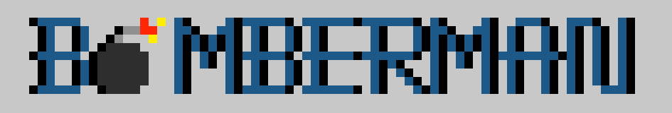

  <b><i>Fig 1. Game title.</i></b>

### Game preview

  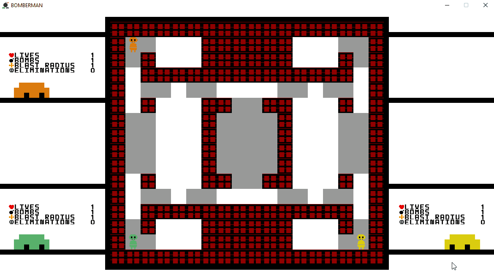

  <b><i>Gif 1. Game preview.</i></b>

 
 

### Menus

  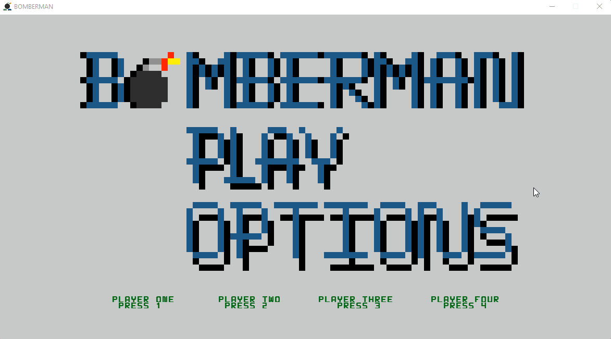

  <b><i>Gif 2. Main Menu. </i></b>

  

 
 

  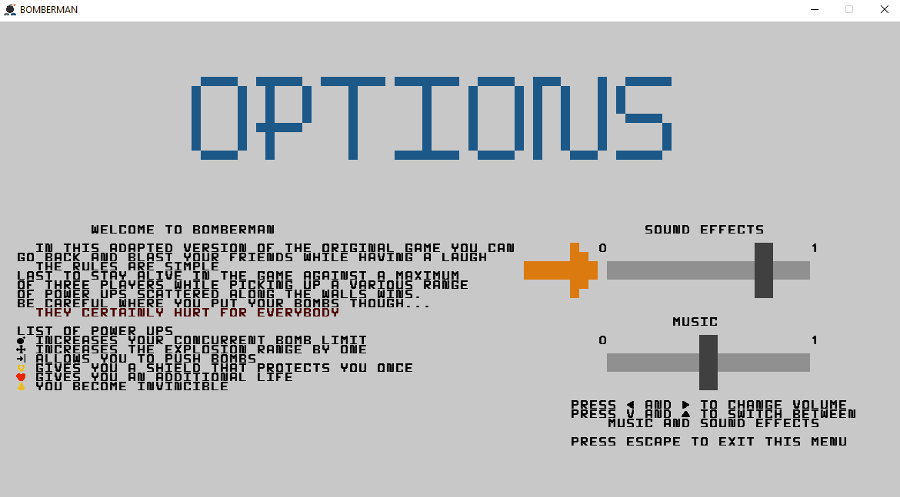

  <b><i>Gif 3. Options Menu. </i></b>  

  

### Power-Ups

  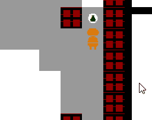

  <b><i>Gif 4. Invincibility and Extra Bombs. </i></b>

 
 

  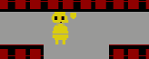

  <b><i>Gif 5. Shield. </i></b>

 
 

  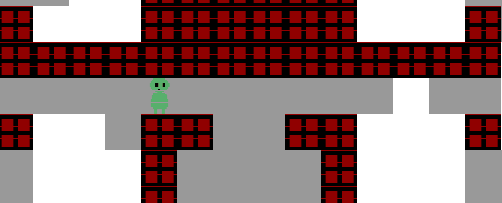

  <b><i>Gif 6. Push The Bomb. </i></b>

 
 

  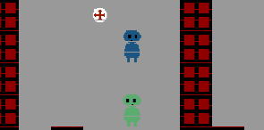

  <b><i>Gif 7. Blast Size. </i></b>

 
 

  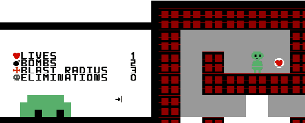

  <b><i>Gif 8. Extra Life. </i></b>

### Animations

  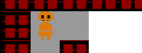

  <b><i>Gif 9. Bomb exploding. </i></b>

 
 

  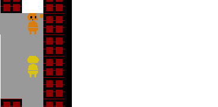

  <b><i>Gif 10. Elimination animation. </i></b>

 
 

  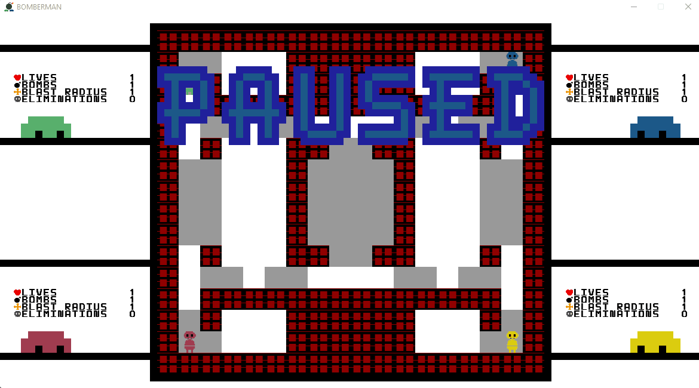

  <b><i>Gif 11. Game paused. </i></b>

 
 

  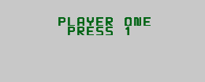

  <b><i>Gif 12. Player choosing. </i></b>

 
 

### End Game

  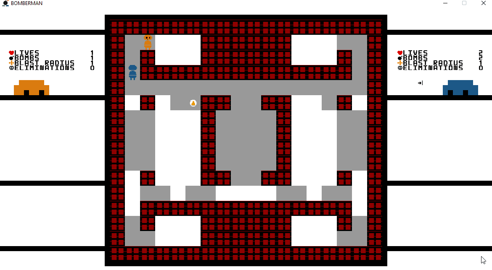

  <b><i>Gif 13. Winner messsage. </i></b>

 
 