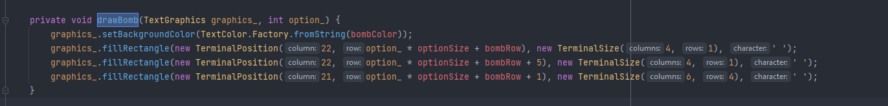
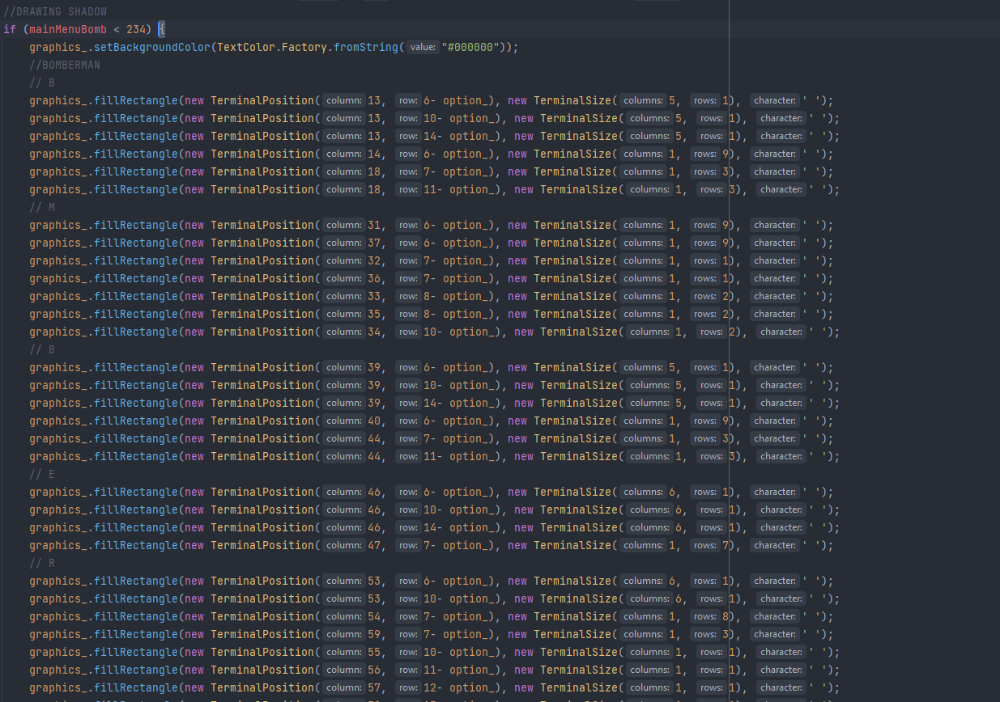
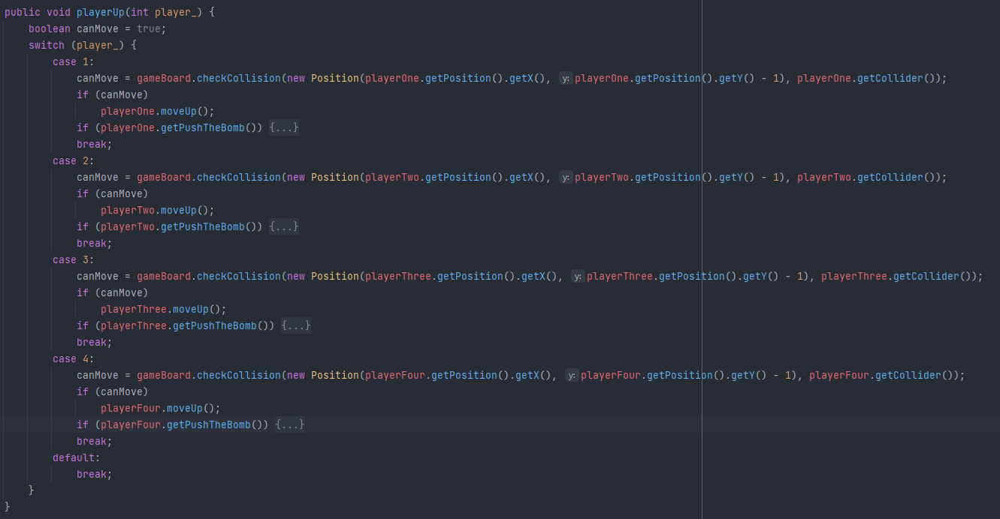
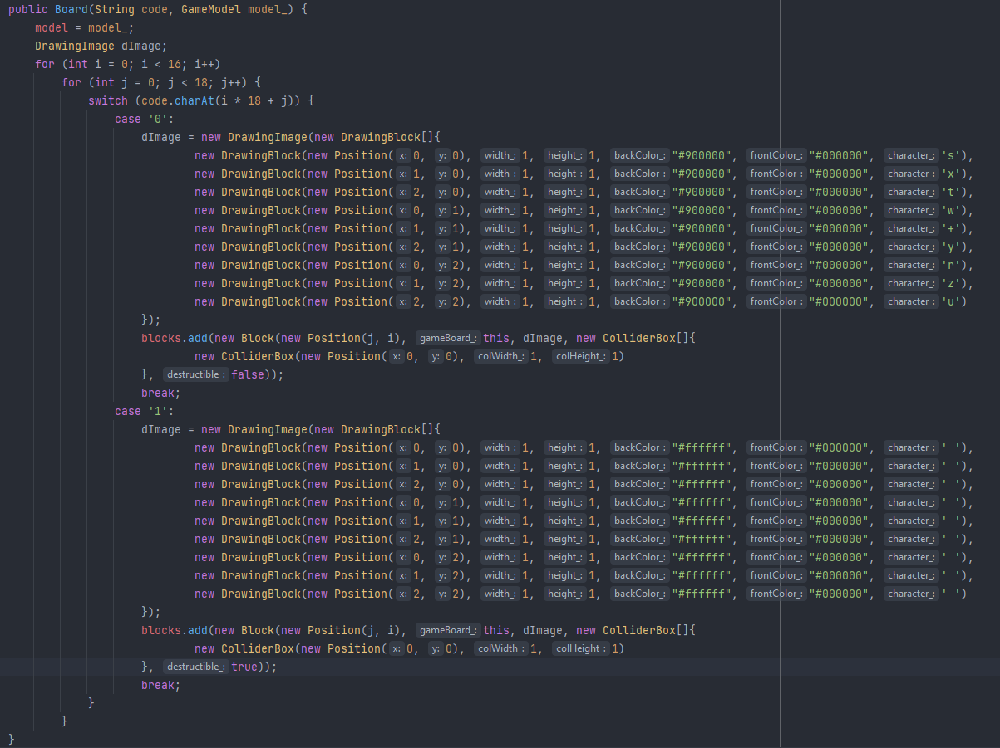
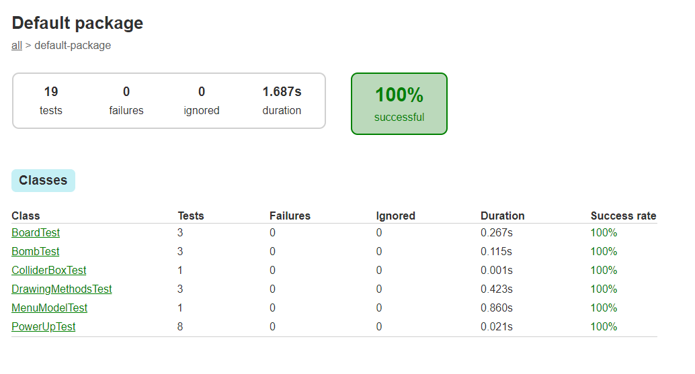
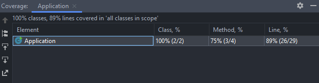

# LDTS_T09_G03 - BOMBERMAN

## Game Description

**Remember Bomberman:**
Bomberman is a strategic, maze-based computer and video game franchise.
Players are put in a maze where they have to destroy soft blocks and uncovering items/power ups.
Play this multiplayer game with your friends and show us who is the best by blowing up your competition.

This project was developed by 
- Afonso Abreu (up202008552@edu.fe.up.pt) 
- André Ávila (up202006767@edu.fe.up.pt)
- João Malva (up202006605@edu.fe.up.pt) 

for LDTS 2021/2022.

Have fun exploding bombs in your friends' faces, but be careful not to get killed in the process.

## IMPLEMENTED FEATURES
**Home Menu** -  In this menu you can select the player's number and check the commands that he will use in the gameplay.

**Secondary Menus** - There is a menu called "Options" which lets the player control the volume of both sound effects and music while also giving a little introduction to the game and explaining briefly what every power-up does.

**4 player movement** - The game is a local multiplayer for two to four players, where each have their own keys and control a Bomberman trying to eliminate the other Bombermans.

**Character Color Choice** - While the game does not start, it is possible for players to change their character's color by pressing the lateral movement keys (left and right) assigned to them.

**Board Loader** - A board selection isn't still implemented but as of now a game board can be created using a string.

**Drawing Methods** - This classes make possible code reusing and the simplification of the view, the drawing methods are composed by the DrawingBlock class, which just draws to the view according to the own variables, the DrawingImage which contains a list of DrawingBlocks that are drawn creating the "image", the DrawingAnimation that contains a list of DrawingImages and their durations on screen, drawing a DrawingImage for her duration then switching to the next DrawingImage stopping at the last DrawingImage if requested when constructing, the DrawingText which transfors a string into DrawingBlocks that contain the information needed to draw every character in the string, and lastly, the DrawingMethod class, which is is inherited by every DrawingMethods class and simply has the draw method, due to the necessity to use the class to represent any DrawingMethods class, this is to ensure that an game object is drawn the same if its visual component is based on a DrawingAnimation or a DrawingImage.

**Power ups** -  Gameplay wise the players has a range of six power-ups that upgrade his capacities like increasing explosion range, increasing the maximum ammount of concurrent bombs, increasing the number of lives, giving the player a shield that protects him from one explosion before vanishing, giving the player invincibility and lastly, the ability to push bombs. This power-ups are obtained by moving towards its icon on the board, the icon appears after a bomb destroys a destructible wall block, the icon that shows up is randomly choosen and might not even appear at all).

**Gameplay** - Each player has five keyboard keys at their disposition, four of them are the movement keys that move their bomberman through the board if the choosen direction isn't occupied by a bomb (if the power-up PushTheBomb isn't unlocked or the bomb is next to a wall/bomb in that direction) or by a wall, the remaining key is the key that lets the player use a bomb on its current location exploding seconds after that, eliminating/damaging the player or destroying a destructible wall caught up on their explosion radius which is a cross.

**Sound and Music** - There is sound effects when exploding bombs, getting power-ups, being damaged, having shields destroyed etc..., and music while in-game and while in the main menu. The sound effects were made using [Chiptone](https://sfbgames.itch.io/chiptone) and the music was done by Afonso Abreu using [Bosca Ceoil](https://boscaceoil.net/).

## PLANNED FEATURES

All the planned features here previously were completed.

## DESIGN

### General Structure
#### Problem in Context:

Since the project is divided in very different conditions, being those the main menu (A simple GUI for the players to choose options, also being the first thing the player sees) and the game board (a more complex GUI where the game happens meaning that simple options aren't the main focus), it will need to be separated in two different states as only one would be too confusing and difficult to understand.

#### The Pattern:
The main pattern applied to the project is the **_Architectural Pattern_**, more specifically the Model-View-Controller style which is commonly used in a GUI.

#### Implementation:
This pattern was implemented through the creation of three classes of the same package, using the Menu package as an example, there will be the MenuController which manipulates the data present on the model and renders the view (as shown below), the MenuView which mainly serves the purpose of displaying the game to the player and occasionally warn the model when something happens, and the MenuModel which contains most of the data and logic needed.

  

  <b><i>Fig 1. Model, Controller and Viewer pattern design</i></b>

#### Consequences:
The use of these patterns in the current design allow the following benefits:
- Cooperation becomes easier.
- Easy to add new features throughout the development stage.

### Factory
#### Problem in Context:

The game contains several power-ups, due to their differences being their effect on the player and their appearence, they all have their own respective class extending the PowerUp class, therefore the creation of many power-ups with their type being randomly decided would be much easier if there was a method of identifying each with an id and creating through it.

#### The Pattern:
The pattern applied is the **Factory Pattern_**.

#### Implementation:
This pattern was implemented in its own class *PowerUpFactory* that depending on the integer received as id returns a class extended from PowerUp. The classes it returns are BlastSize, ExtraBomb, ExtraLife, Invincibility, PushTheBomb and Shield that are the power-ups available at runtime.
At runtime the power-ups need a Position and a Board, those variables are passed through the PowerUp that receives as arguments a Position, a Board and an integer passing the first two to the PowerUp that corresponds with the integer.

  

  <b><i>Fig 2. Factory pattern design</i></b>

#### Consequences:
The use of this pattern in the current design allow the following benefits:
- Reusable construction code when creating multiple power-ups of different types.
- Open/Closed Principle. Its easier to introduce new power-ups without breaking the current code.

## CODE SMELLS AND POSSIBLE REFACTORINGS

### Bloaters

A code smell commonly present in our program is the Long Method bloater, one of the major causes of it are the UI, for example:

**Long Method** - In order to make the menu UI interactive and animated a big chunk of code was hard-coded at first, then simplified using the Drawing Methods, however, this simplification wasn't enough as the code is still extensive and difficult to read. The screenshot below shows a part of the main menu's bomb which animates differently after an option is selected making it necessary to create this overcomplicated code instead.

  

A refactoring solution to this problem would be the *Extract Method*. This refactoring was used in the same class to draw the bomb when an options hasn't been selected as shown below:

  

### Dispensables

Another code smell that appears mainly on the view is the Duplicate Code.

**Duplicate Code** - This code smells appears more than once and usually the code is not totally identical, one instance where this happens is the draw of the shadows on the main menu because its y position changes depending on the position of the bomb on the menu, otherwise being the exact same as what they are shadows of colored color. The screenshot below shows the code mentioned.

  

A refactoring solution for this problem would be the *Form Template Method* which would draw the objects (in this case the letters and the bomb) and then their shadows using a  variable to signilize if it is a shadow (coloring it black) and a variable to give its y position. This method was similarly used in the Game package where the move functions would be the same for the four players, using an int to check which player moves, as shown below.

  

**Speculative Generality** - This code smells appears on the Board class's constructor, the game board was planned to be selectable by the player, therefore its constructor was made to read a string that would then be used to create the Blocks 

  

### Change Preventers

This code smell appears in this list primarily in the Board Class.

**Divergent Changes** - This code smell appears in the Board class as this class manages everything board related. Due to the game obviously taking place in the board, the last one not only manages the board but has to manage some game logic as shown below in the method loop.

  

A refactoring solution for this problem would be the *Extract Class* which would divide the management of game logic and the management of the board elements into different classes, making the code more organized and easier to read.

## TESTS

  

  <b><i>Fig 3. Tests</i></b>

 

  

  <b><i>Fig 4. Code Coverage</i></b>

### SELF-EVALUATION

- Afonso Abreu 33.3%
- André Ávila 33.3%
- João Malva 33.3%

# ldts-project-assignment-g0903
ldts-project-assignment-g0903 created by GitHub Classroom
