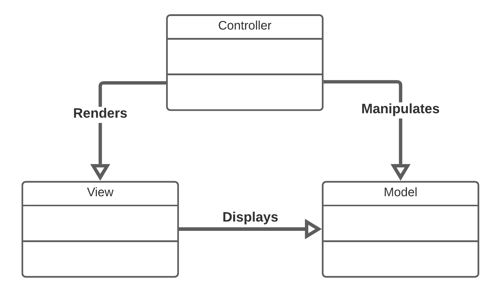
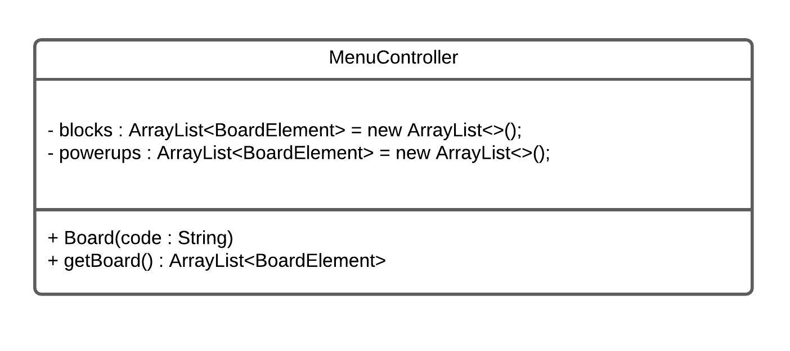

# LDTS_T09_G03 - BOMBERMAN

## Game Description

**Remember Bomberman:**
Bomberman is a strategic, maze-based computer and video game franchise.
Players are put in a maze where they have to destroy soft blocks and uncovering power ups.
Play this multiplayer game with your friends and show us who is the best by blowing up your competition.
This project was developed by Afonso Abreu (up202008552@edu.fe.up.pt), André Ávila (up202006767@edu.fe.up.pt) and João Malva (up202006605@edu.fe.up.pt) for LDTS 2021/2022.
Have fun exploding bombs in your friends' faces, but be careful not to get killed in the process.

## IMPLEMENTED FEATURES
**Home Menu** -  In this menu you can select the player's number and check the commands that he will use in the gameplay.

**Character Color Choice** - While the game does not start, it is possible for players to change their character's color by pressing the lateral movement keys (left and right) assigned to them.

**Board Loader** - A board selection isn't still implemented but as of now a game board can be created using a string.

**Drawing Methods** - This classes make possible code reusing and the simplification of the view, the drawing methods are composed by now of the DrawingBlock class, which just draws to the view according to the own variables, and the DrawingImage which contains a list of DrawingBlocks that are drawn creating the "image".
## Planned Features
**Secondary Menus** - menus that allow manipulation of sound/music and among other game settings.

**4 player movement** - All players must move correctly depending on the keys assigned to their movement.

**Power ups** -  Powers and upgrades like increase explosion range, increase maximum number of bombs, lives, shields, push bombs, in order to spicy the game.

**Gameplay** - Coordinate the movements of the characters in the maze and the game events (death, lives, power ups...).

**Sound and Music** - Sounds in different interactions and music during game.

**Animations** - Part of the drawing methods, the DrawingAnimation will be a class that contains a list of DrawingImages and their durations on screen, drawing a DrawingImage for her duration then switching to the next DrawingImage. An animation controller might be added if needed (containing a set of animations).

## DESIGN

### General Structure
#### Problem in Context:

Since the project is divided in very different conditions, being those the main menu (A simple GUI for the players to choose options, also being the first thing the player sees) and the game board (a more complex GUI where the game happens meaning that simple options aren't the main focus), it will need to be separated in two different states as only one would be too confusing and difficult to understand.

#### The Pattern:
The main pattern applied to the project is the **_Architectural Pattern_**, more specifically the Model-View-Controller style which is commonly used in a GUI.

#### Implementation:
This pattern was implemented through the creation of three classes of the same package, using the Menu package as an example, there will be the MenuController which manipulates the data present on the model and renders the view (as shown below), the MenuView which mainly serves the purpose of displaying the game to the player and occasionally warn the model when something happens, and the MenuModel which contains most of the data and logic needed.

  

  <b><i>Fig 1. Model, Controller and Viewer pattern design</i></b>

#### Consequences:
The use of these patterns in the current design allow the following benefits:
- Cooperation becomes easier.
- Easy to add new features throughout the development stage.

### Board Builder
#### Problem in Context:

The game's board is composed of several objects (BoardElements), therefore the creation of a board is very difficult and confusing if done by creating a function for evey different board.

#### The Pattern:
The pattern applied is the **_Builder Pattern_**.

#### Implementation:
This pattern was implemented inside the Board's constructor, using a string, every character of the string will originate a new BoardElement that will be stored in the Board class.

  

  <b><i>Fig 2. Builder pattern design</i></b>

#### Consequences:
The use of these patterns in the current design allow the following benefits:
- Reusable construction code when building multiple elements.
- Allows for a bigger range of board possibilities.
### SELF-EVALUATION

- Afonso Abreu 33.3%
- André Ávila 33.3%
- João Malva 33.3%

# ldts-project-assignment-g0903
ldts-project-assignment-g0903 created by GitHub Classroom
